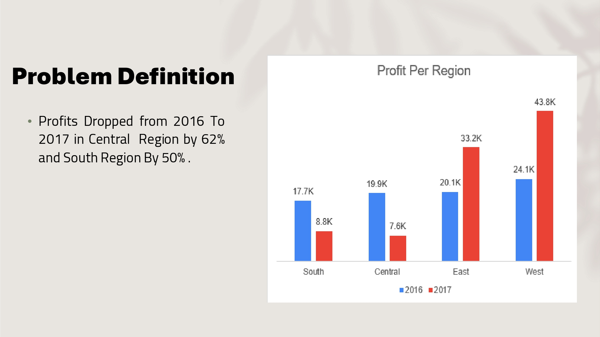
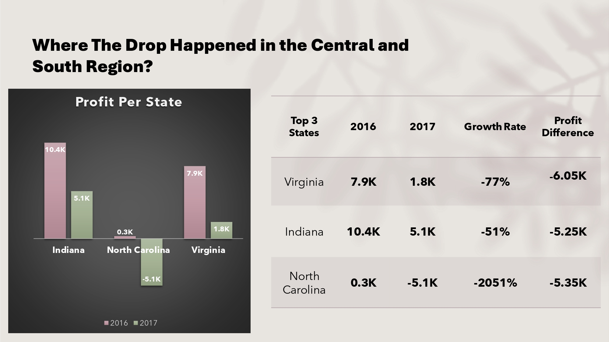
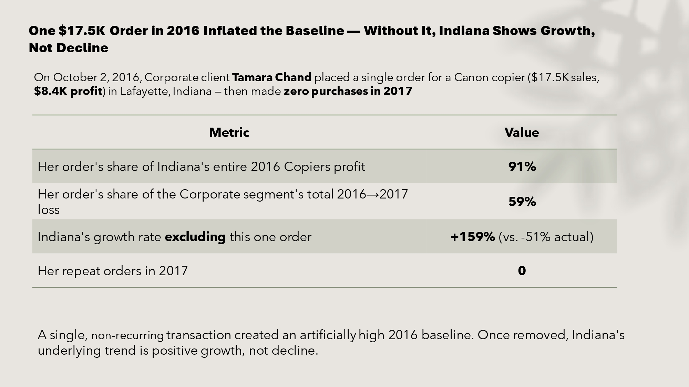
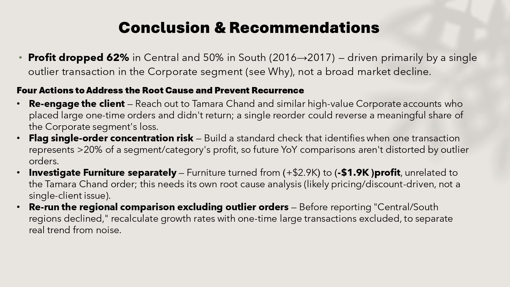

# Central & South Region Profit Drop — Root Cause Analysis

**Investigating a 62% (Central) and 50% (South) profit decline between 2016 and 2017 using the 5W framework — and uncovering that most of it was a statistical artifact, not a real business decline.**

---

## 📌 Business Question

Profit dropped sharply in the Central and South regions from 2016 to 2017 while other regions grew. **Why did this happen, and is it a genuine operational problem or something else?**

---

## 🔍 Approach

I used the **5W framework** (Where, What, Who, When, Why) to drill down from a regional headline number into a single root cause, then validated every number directly against the raw transaction data before presenting it.

| Step | Question | Finding |
|---|---|---|
| 1 | **Where** did it happen? | Indiana (-51%), Virginia (-77%), North Carolina (-2051%) drove the regional drop |
| 2 | **What** dropped? | Technology category, specifically Copiers & Machines sub-categories |
| 3 | **Who** was affected? | Corporate segment absorbed $14.1K of the total loss (85% decline) |
| 4 | **When** did it happen? | Losses concentrated in Q4 2017 (Oct–Dec), -$28.3K |
| 5 | **Why** did it happen? | A single $17.5K one-time order in Oct 2016 inflated the prior-year baseline |

---

## 💡 Key Insight

On October 2, 2016, one Corporate client placed a single large order for a Canon copier ($8.4K profit) in Lafayette, Indiana — then made **zero purchases in 2017**.

- This one order represents **91%** of Indiana's entire 2016 Copiers profit
- It accounts for **59%** of the Corporate segment's total 2016→2017 loss
- **Removing this single transaction, Indiana's growth rate flips from -51% to +159%**

## 🎯 So What?

The headline "62%/50% profit drop" overstates the real trend. A large part of it is a **high 2016 baseline caused by one non-recurring transaction**, not a broad decline across the region, category, or segment. Treating it as a systemic problem would misdirect corrective action.

## ✅ Recommendations

1. **Re-engage the client** — a single reorder from this account (or similar high-value Corporate accounts) could reverse a meaningful share of the reported loss.
2. **Flag single-order concentration risk** — build a standard check that flags when one transaction represents >20% of a segment/category's profit, to prevent future YoY comparisons from being distorted by outliers.
3. **Investigate Furniture separately** — Furniture turned from +$2.9K to -$1.9K profit, a decline unrelated to the Corporate/Copiers story and likely pricing/discount-driven; it needs its own root cause analysis.
4. **Re-run regional comparisons excluding outlier orders** before reporting a "regional decline," to separate real trend from noise.

## 📊 Confidence Level

**High** confidence in the descriptive numbers — every figure in this analysis was independently verified against the raw transaction data. **Medium** confidence in the single-client explanation as the *complete* story — the unrelated Furniture decline indicates at least one additional driver exists.

---

## 🖼️ Presentation Preview

| | |
|---|---|
|  |  |
|  |  |

Full slide-by-slide screenshots are in [`/screenshots`](./screenshots).

---

## 🛠️ Tools Used

- **Excel** — pivot tables, YoY growth calculations, transaction-level validation
- **PowerPoint** — insight-driven narrative deck following the 5W framework

## 📁 Repository Contents

```
├── README.md
├── Profit_Drop_Root_Cause_Analysis.pptx   → full presentation
├── Profit_Analysis_Data.xlsx              → source data + pivot analysis
└── screenshots/                           → slide-by-slide preview (13 slides)
```

## 📂 Data Source

Sample retail transaction dataset (Sales, Profit, Region, Category, Customer-level detail), 9,994 rows, 2014–2017.

---

*Part of a growing data analytics portfolio — [see more projects](../).*
